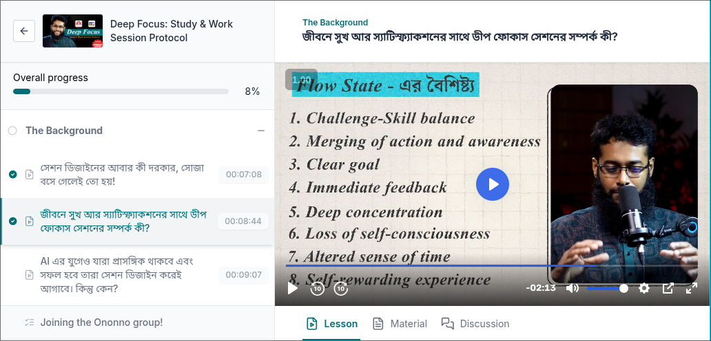

## The background module

### Relation with happiness, satisfiction and deep focus

#### ,, 1. ha,ha(heha)=>

#### ,, 2. ,,HA,sa,d(hesed) = Relation with ,,HAppiness, ,,SAtisfiction and ,,Deep focus

#### ,, 3. ,,hi,pe,f(hepef) =>

`,,HIgher income people, ,,PLEasure, ,,Flow state=> we think the most happiest persons are the ,,HIgher income group people. but reasearch prooves that higher income group and lower income group people's happiness difference is very low. also we consider pleasure is happiness but it's only a shortime pleasure nothing else. pleasure means eating delicious foods, incur relationship with beautiful girls etc. So which is the real happiness? scientist ans: ,,Flow state. the people who can dive in flow state as much as possible they are the most happiest person`

#### `Flow state characteristics`

,,, cha,m,c,i,d,l,a,s(chemkid, les)

1. ,,CHAllenge-skill balance
2. ,,Merging of action and awareness = the task is predefined before starting session. then brain auto does the task, not think and decide what to do now and then
3. ,,Clear goal
4. ,,Immediate feedback
5. ,,Deep concentration
6. ,,Loss of self-consciousness= attention is so high that only the session and it's task is the whole matter nothine else
7. ,,Altered sense of time = forget time, at this period we have no sense of time. time goes very fast
8. ,,Self-rewarding experience= evaluate our self not the result we get, instead only how many times we can go flow state. reward our self with the frequency of flow state going not by it's result.

> #### Deep work Book learning

It mainly focuses how people can frequently go flow state
Explain how feedback can help to go flow state

> [chatgpt explain: very IMPORTANT](https://chatgpt.com/share/695bdd63-52c4-800c-84b1-969a1567a47c)

  

> [paid course source](https://iframe.mediadelivery.net/embed/421524/7c8d62de-3e89-4154-93aa-7639fc232bf9?token=8272144a3ba2eed49c280197cc8f58edfbe6fd1d10588733e2b8992cedf7ee37&expires=1767625946&autoplay=true&preload=false&loop=false&muted=false&responsive=true)

