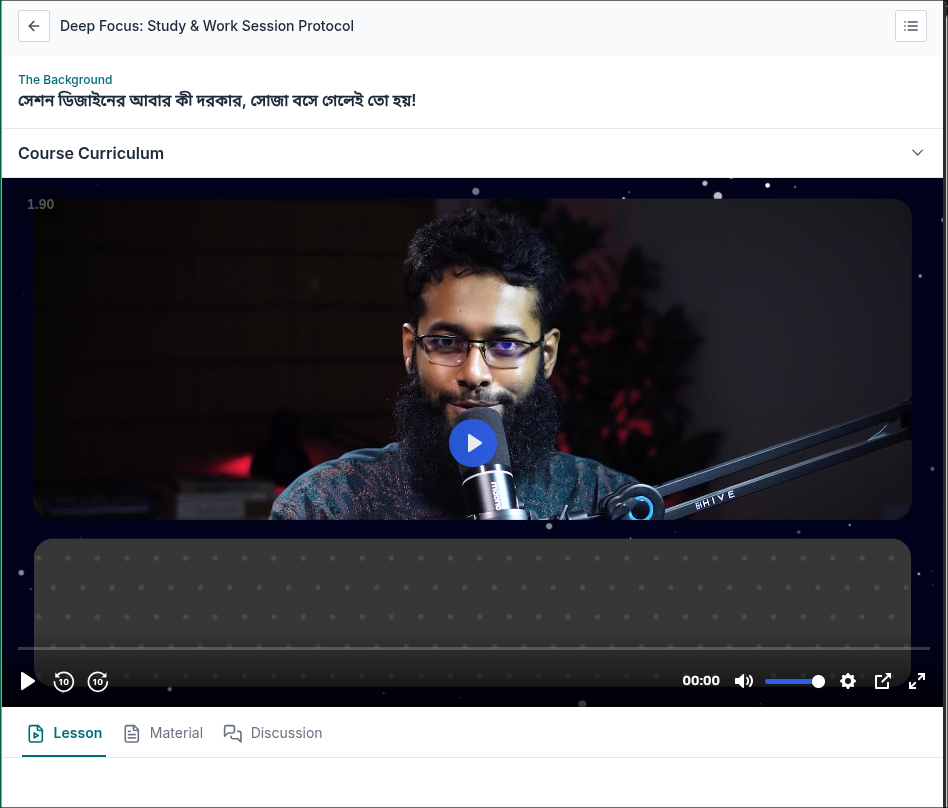

## The background module

## Importance of session design

,,o,r(ar)=>

#### If this topics get full marks then system is okay for productivity, otherwise we need to rebuild our system

1. ,,o=O,ti,r,e,d(atared 5)
2. ,,ri,e,b,no,c(riebnok 5)

# 1. ,,o=O,ti,r,e,d(atared 5) Explanation

- `1.1: ,,Outcome=Before the session must set clear outcome, not generalized outcome rather specific time bound target`
- `1.2: ,,TIme block= must use ,,TIme block session as like pomodoro technique. only focus to the specific task in this block. no way focus can be switched during this time block`
- `1.3: ,,Regular schedule=`
- `1.4: ,,Environment= keep an ,,Enviroment which can extract best output. conciously well organized session envrionment`
- `1.5: ,,Distraction = ,,Distraction free session. keep everything away which can distract`

# 2. ,,ri,e,b,no,c(riebnok 5) Explanation

- `2.1: ,,RItual= keep session activation ,,RItual. every most successful person has great activation ritual`
- `2.2: ,,Energy management= ensure session period ,,energy sustaining. during session we need energetic physically, mentally bolded`
- `2.3: ,,Break= session ,,Breaking, after completing the session how to properly break the session we need to learn this`
- `2.4: ,,Not do list= we must have a not to do list. during session we never do any task listed here`
- `2.5: ,,Closing= need to learn how to ,,Close the session. we must build a best closing mechanism of the session. so that we can sustain the learning long time. and reserve everything from the session`

[chatgpt explain: very important ](https://chatgpt.com/share/695bc6b0-812c-800c-90bd-0e605d819ef6)
 

[paid course source](https://learn.fahimabdullah.com/student/courses/deep-focus-study-work-session-protocol/lessons/%E0%A6%B8%E0%A7%87%E0%A6%B6%E0%A6%A8-%E0%A6%A1%E0%A6%BF%E0%A6%9C%E0%A6%BE%E0%A6%87%E0%A6%A8%E0%A7%87%E0%A6%B0-%E0%A6%86%E0%A6%AC%E0%A6%BE%E0%A6%B0-%E0%A6%95%E0%A7%80-%E0%A6%A6%E0%A6%B0%E0%A6%95%E0%A6%BE%E0%A6%B0-%E0%A6%B8%E0%A7%8B%E0%A6%9C%E0%A6%BE-%E0%A6%AC%E0%A6%B8%E0%A7%87-%E0%A6%97%E0%A7%87%E0%A6%B2%E0%A7%87%E0%A6%87-%E0%A6%A4%E0%A7%8B-%E0%A6%B9%E0%A6%AF%E0%A6%BC)

