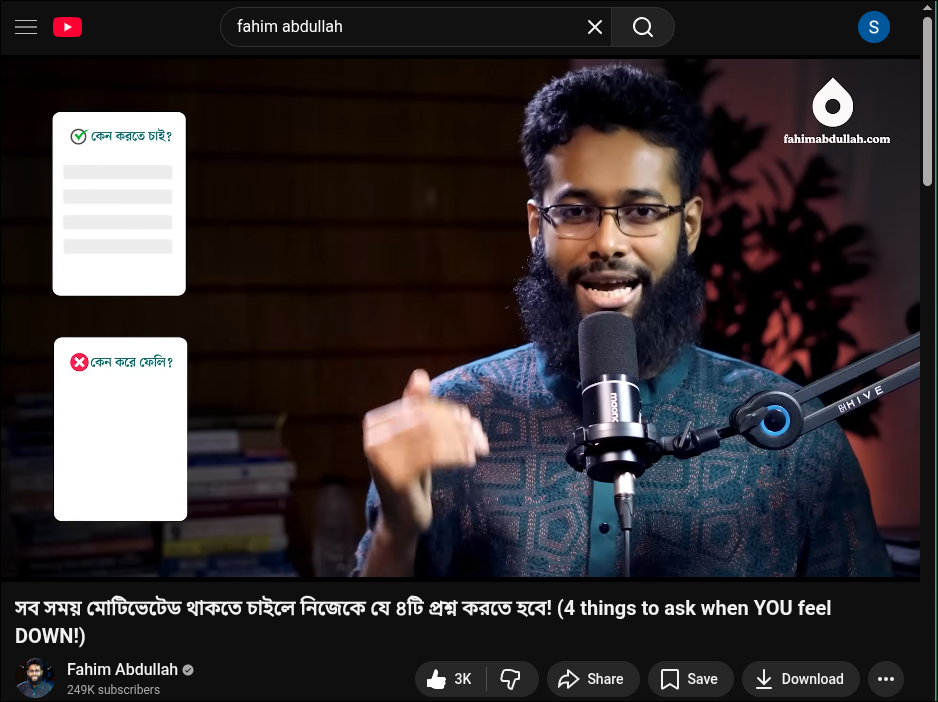

## 01/01/2026 07:05 PM Thu GMT+6 Banasree, Rampura, Dhaka

# 1. ,, mo,f(mof)=>sustain long time ,,MOtivation with ,,F=4 why question to own self

## 2. ,,wh,t,u,me,n(hotamin) =>

    2.1: ,,WHy do i do this task. (Why should I do the things I do or want to do? je kajgulo ami kori baaa korte chai segulo keno korbo)

    2.2: ,,Unexpected task: why do i do the unexpected task that i don't want to do(je kajgulo ami korte chai na segulo keno kore feli)

    2.3: why not ,,Me > when i praise or exclaime by seeing any good activity from other why not me. (je kajgulo dekhe ami onk khusi hoi, se kajgulo ami kno korbo na)

    2.4: why not ,,Now> the task i want to do, why not now (je kaj gulo ami korte chai, ekhoni kno korchina)

## [chatgpt reference important to read](https://chatgpt.com/share/6954035c-6ef8-800c-a185-0bc94b3f1be7)

## [yt link](https://www.youtube.com/watch?v=GweQZhY9FHE)

## [github pdf link][https://github.com/shahjalal-labs/knowledge/blob/main/fahim_abdullah/self_control/self_control.pdf]

## [website digital download link][https://learn.fahimabdullah.com/student/digital-downloads/7-powerful-techniques-to-control-stress-immediately]

